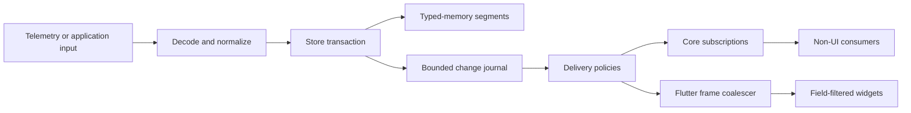
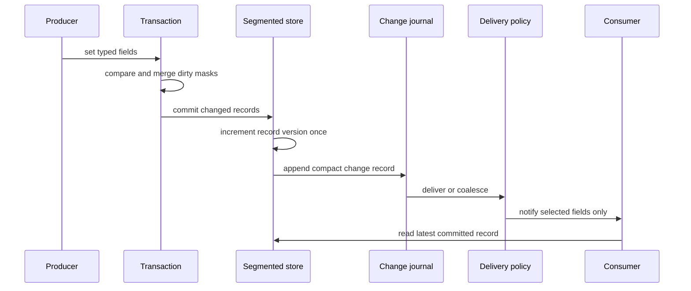
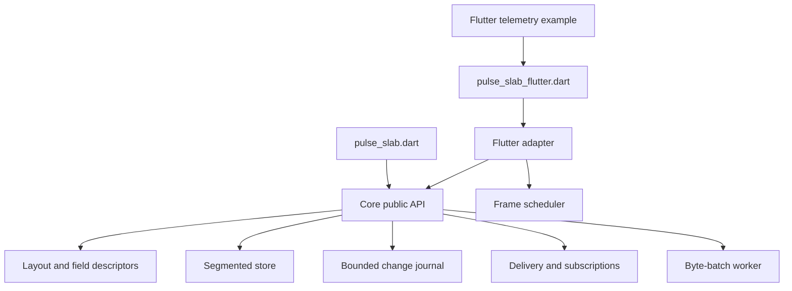

# Architecture

`pulse_slab` separates a high-rate data plane from the lower-rate UI plane. The data plane processes every valid input update. The delivery layer is allowed to merge replaceable state changes before they reach a specific consumer.

## Data plane and UI plane

The store owns record lifetime, version counters, typed segments, and subscriptions. Flutter adapters observe committed changes but do not own the store. This makes core tests independent of widget bindings wherever possible.

## Write, commit, and notification flow

A transaction creates no notification for an unchanged field. Multiple writes to one record merge into one dirty mask and one version increment during a single commit. Nested transactions are deliberately rejected so commit boundaries remain predictable. While a transaction is active, public store reads, version reads, subscription registration, and flush calls reject access; a transaction writer is the only in-transaction reader. This prevents a synchronous consumer from observing partial writes.

## Module structure

Implementation details live under `lib/src`. The primary library exports core data-plane types. The Flutter entry point is separate so applications that only need the core API do not import widget classes accidentally.

## Design boundaries

- Record layouts are fixed after construction; a field descriptor is a stable typed token, not a string lookup in the hot path.
- Each live record has one segment, slot, generation, and monotonically increasing version.
- The journal is bounded and tracks replaceable state. It is not a guarantee of lossless domain-event delivery.
- Notification traversal is scoped to a record's subscriptions, not a global listener scan.
- Delivery callbacks observe an already committed store state. A callback may start a follow-up transaction: immediate delivery dispatches that follow-up synchronously, while latest and batched delivery retain it until a later flush. Defer feedback-loop writes when a flat callback sequence is required.
