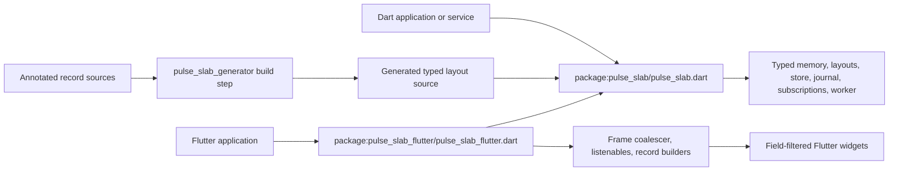
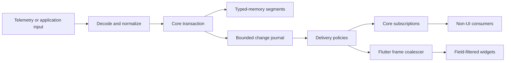
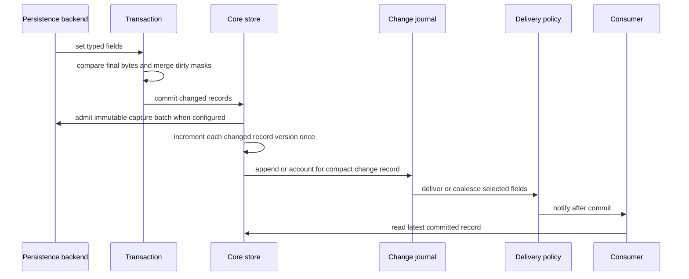
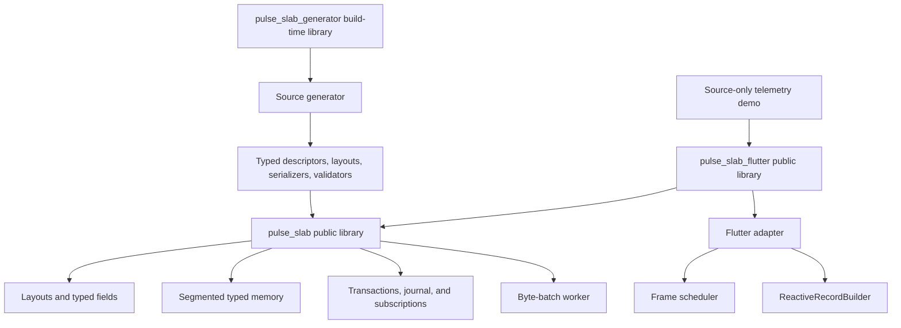

# Architecture

`pulse_slab` is organized as a data plane, an optional persistent capture plane,
and an optional Flutter UI plane. The pure Dart core owns layouts, memory,
transactions, record lifetime, journals, subscriptions, byte-batch workers, and
portable persistence contracts. The Flutter adapter observes committed core
state and schedules UI-facing notifications; it does not own or mutate the
store outside normal core transactions. The native persistence package receives
immutable capture bytes after a completed store boundary and owns file I/O and
replay.

## Package boundary

The core package has no Flutter SDK dependency. A Flutter application can depend on `pulse_slab_flutter` alone because it re-exports the core public API. A non-Flutter application should depend directly on `pulse_slab` and avoid importing UI concepts. Applications that opt into `pulse_slab_generator` use it only as a development dependency: it reads core annotations and writes typed source that depends on the core runtime, not on the generator at runtime.

The repository uses a Pub workspace for development. It resolves the local
versioned packages as one dependency graph; the published packages retain their
normal hosted dependency boundary.

## Persistent capture plane

`PulseStore` accepts an optional `PulseStorePersistence` backend. The core
creates a full-record capture only after it has computed a transaction's net
changes. Capture admission runs before record versions, `ChangeJournal`, and
subscription delivery are advanced. A rejected admission restores the
transaction; accepted capture is not a filesystem durability barrier.

The capture plane is separate from the journal and UI delivery plane. Core
captures use the versioned `StoreCaptureCodec` format, which includes raw
record bytes, record coordinates, layout identity/version, snapshots, and
release operations. `pulse_slab_persistence_io` receives only immutable encoded
bytes and owns native file I/O, ordered replay, and acknowledgement progress.
The complete contract is in [Persistent capture and replay](persistence.md).

## Data plane and UI plane

The data plane processes valid inputs and keeps the latest committed record state. The delivery plane can merge replaceable state changes before they reach a consumer. This distinction prevents a high-rate source from forcing a UI rebuild for every intermediate value.

## Write, commit, and notification flow

A transaction produces at most one change record and one version increment for each affected record. A write that changes a field and restores it before commit produces no net state change, version increment, or notification. Nested transactions are rejected to preserve a clear commit boundary.

While a transaction callback is active, public reads, version reads, subscription registration, and flush calls reject access. Retained readers and fixed-byte views reject access as well. A transaction writer is the only in-transaction reader. This prevents synchronous consumers from observing partially written record bytes before the commit boundary. Transaction and `update` actions must complete synchronously; a returned `Future` is rejected and the synchronous prefix is rolled back.

## Module structure

Implementation details stay under each package's `lib/src` directory. The core public entry point exports only data-plane concepts. The Flutter public entry point exports the core API plus Flutter-specific adapters. The generator is an optional third package and is executed by `build_runner`; it remains outside the runtime dependency graph.

## Delivery and lifecycle boundaries

- The complete capacity, ordering, overflow, flush, reentrancy, and
  per-subscription metric contract is in
  [Delivery policies](delivery_policies.md).
- Record subscriptions are stored per handle, so dispatch does not scan a global listener collection.
- Matching callbacks run in registration order after state has committed. Removing a subscription during dispatch is safe; inactive subscriptions are skipped.
- A commit made while immediate dispatch is active queues matching immediate
  calls until that traversal finishes. The fixed
  `maxReentrantImmediateDeliveries` ring retains pending listener deliveries
  from synchronous state commits and replaces its oldest pending delivery when
  full, incrementing
  `droppedReentrantImmediateDeliveryCount`. A commit from a latest or batched
  flush callback invokes matching immediate listeners inline; it does not use
  the reentrant ring. During an active immediate traversal, latest and batched
  subscriptions enter their own policy queues immediately.
- A callback may release a record or dispose the store. Later callbacks only run while their target and store remain active.
- Listener failures do not roll back an already committed transaction or stop other eligible callbacks in the same traversal. After the outermost dispatch, the first listener failure is rethrown with its original stack trace.
- Record listeners and lifecycle invalidation callbacks are synchronous APIs. Their returned futures are not awaited or routed through listener failure handling.
- `flush()` rejects a reentrant call from a latest or batched delivery callback, so each queue traversal remains deterministic.
- The journal is bounded. With overwrite behavior, older replaceable journal entries may be discarded. With reject-newest behavior, the state commit still succeeds and `PulseStore.rejectedJournalChangeCount` reports rejected journal admission.
- The journal is not a lossless event queue. A lossless event must use a separately acknowledged channel.
