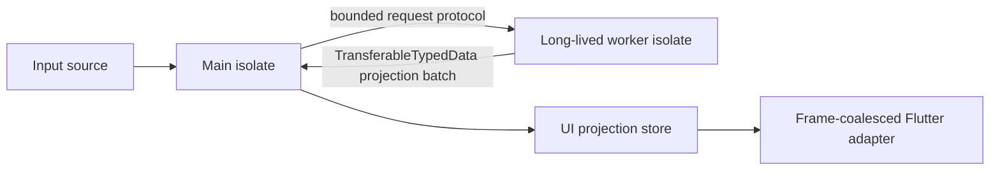

# Concurrency

## Ownership model

The package uses isolate ownership rather than pretending ordinary Dart memory is shared. The main isolate owns the UI projection store, subscriptions, and Flutter scheduling. A long-lived worker isolate owns decoding or computation for a byte-batch workload and sends compact batches back to the main isolate.

`Uint8List`, arbitrary Dart objects, and regular typed-data buffers are not shared mutable memory between isolates. `TransferableTypedData` moves a transferable byte region by ownership transfer; the receiver materializes it. It is not a bidirectional shared buffer.

## Worker protocol and backpressure

The byte-batch worker keeps at most a bounded number of messages in flight. If a caller submits faster than the worker can acknowledge, `submit` throws `WorkerBackpressureException` instead of growing an unbounded queue. A producer of replaceable inputs may choose to retain its own latest batch and retry later. A producer of lossless inputs must await capacity or use a separately acknowledged persistent event path; the worker never silently drops a submitted batch.

Workers are long-lived. Spawning an isolate per update costs more than it saves and makes latency unpredictable.

## Startup, failure, and shutdown

Worker startup returns a handle only after the worker port is ready. Worker exceptions and uncaught errors are forwarded to the owning isolate as typed errors. Shutdown stops accepting new work, lets already accepted messages finish in receive-port order, requests a worker stop, closes ports, and completes only once the worker confirms it stopped.

## FFI boundary

The core package does not require native compilation. A future FFI backend must be isolated behind a memory abstraction and must document allocation ownership, lifetimes, synchronization, and isolate restrictions. A raw pointer is not an observable store and is not safely accessible from arbitrary isolates without an explicit native synchronization protocol.
