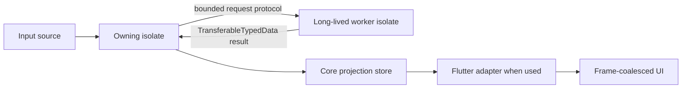

# Concurrency

## Ownership model

The pure Dart `pulse_slab` package follows isolate ownership. A store, its typed-memory segments, subscriptions, and record handles belong to one isolate. The optional `pulse_slab_flutter` adapter runs in the UI isolate and observes the main-isolate projection store.

`Uint8List`, arbitrary Dart objects, and ordinary typed-data buffers are not shared mutable memory between isolates. `TransferableTypedData` transfers a byte region by ownership; the receiver materializes it. It is not a bidirectional shared buffer, and a `RecordHandle` from one isolate is not valid in another store or isolate.

## Main-isolate responsibilities

The owning isolate is responsible for:

- Allocating, updating, reading, and releasing records.
- Maintaining transactions, versions, journals, and subscriptions.
- Applying decoded worker results to the local projection store.
- Scheduling Flutter frame delivery when the Flutter adapter is present.

The core package remains usable in a command-line or server isolate without loading Flutter. Flutter widgets must stay on the UI isolate and should read the latest committed local projection rather than receive a stream of arbitrary record objects from a worker.

## Worker responsibilities

The focused byte-batch worker is long-lived. It owns its decoding or transformation work and sends compact results back to the caller. Spawning a new isolate for each update would add avoidable startup cost and unstable latency.

The worker accepts transferable byte batches rather than arbitrary closures or shared pointers. This keeps ownership, serialization, and error handling explicit. The API is intentionally focused so it can remain honest about what crosses an isolate boundary.

## Persistent file capture

`FileStorePersistence` runs one long-lived native I/O isolate for one journal
directory. The owning store isolate encodes an accepted capture batch into an
independently owned buffer and transfers it with `TransferableTypedData`. The
I/O isolate writes and replays those bytes; it never receives a record handle,
reader, writer, typed-memory segment, or reference to live store memory.

The file backend takes an exclusive journal lock while it is open. A second
writer fails explicitly instead of interleaving frames. One backend instance is
attached to one `PulseStore` lifetime, and replay offers one active delivery at
a time. Acknowledgement is serialized after the delivered frame has been
flushed, so an unacknowledged delivery is available after restart.

## Backpressure and event semantics

The worker keeps a bounded number of messages in flight. When capacity is exhausted, submission fails with backpressure instead of appending to an unbounded queue. A replaceable-state producer may retain its own newest batch and retry later. A lossless producer must await capacity or use a separately acknowledged persistent transport.

The core change journal has the same boundary: it is bounded state-observation infrastructure, not an event log. Journal overwrite and reject-newest policies are observable state-delivery trade-offs; neither is a substitute for reliable event delivery.

The native persistence backend separately bounds unacknowledged encoded replay
payloads with `maxPendingBytes` and retained physical segment bytes with
`maxJournalBytes`. `maxSegmentBytes` bounds one append-only segment. It rejects
a new capture with `StorePersistenceBackpressureException` when either bound
would be exceeded. Acknowledging the oldest delivery releases logical replay
capacity; physical bytes are released once a fully acknowledged closed segment
can be reclaimed. These limits are independent of `ChangeJournal` capacity and
subscription delivery queues.

## Startup, failure, and shutdown

Worker startup completes only after the worker port is ready. Worker exceptions and uncaught errors are forwarded to the owning isolate as typed errors. Shutdown stops new submissions, completes accepted work in receive-port order, requests a worker stop, closes communication ports, and completes after the worker confirms shutdown.

Callers should close workers during application shutdown and dispose Flutter listenables or widgets normally. A disposed store no longer accepts reads, writes, subscriptions, or delivery work.

## FFI boundary

Neither package requires native compilation. A future FFI backend must live behind a dedicated memory abstraction and document allocation ownership, lifetimes, synchronization, and isolate restrictions. A raw pointer is not an observable store and must not be treated as safely shareable across Dart isolates without an explicit native synchronization protocol.
