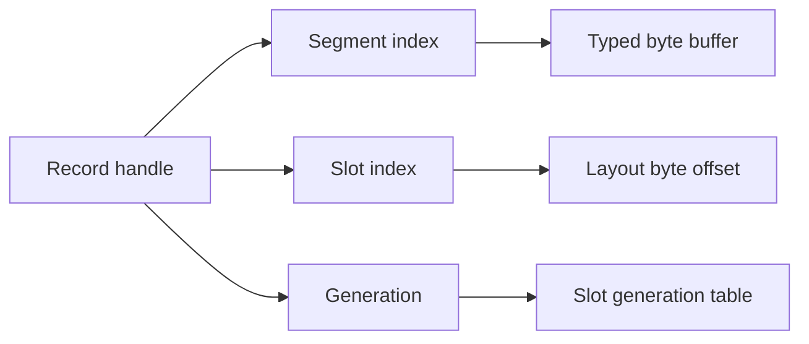

# Memory model

The pure Dart core stores fixed-layout scalar records in typed-memory segments. It does not expose raw addresses as its ordinary API and does not rely on Flutter or native compilation.

## Layouts and fields

A `RecordLayout` describes a fixed-size binary record. Typed field descriptors declare their name, scalar representation, byte width, alignment, and field position. The layout resolves offsets once at construction time, validates duplicate names and unsupported layouts, and exposes its final size and alignment.

The core supports signed and unsigned 8-, 16-, 32-, and 64-bit integers, 32- and 64-bit floating-point values, boolean or bit-flag fields, and fixed-size byte fields. Numeric access uses `dart:typed_data` views and `ByteData` with explicit endianness. Bulk numeric storage does not rely on `List<int>` or `List<double>`.

`Int64Field` and legacy `Uint64Field` are encoded as two 32-bit words, avoiding unsupported 64-bit `ByteData` accessors on Dart JavaScript targets. `Uint64Field` deliberately retains its signed two's-complement `int` bit-pattern behavior: a read whose top bit is set is negative. That preserves existing applications, but JavaScript targets cannot exactly represent every 64-bit `int`.

Use `Uint64ValueField` when new data needs portable full-width unsigned semantics. Its `Uint64Value` keeps bits 63–32 in `highWord` and bits 31–0 in `lowWord`; both are validated unsigned 32-bit values, and the API never combines them into one 64-bit Dart `int`. It compares high word then low word, and its `toBytes`/`fromBytes` methods use an explicit matching `Endian` at a wire boundary.

```dart
final counter = Uint64ValueField('counter');
writer.set(
  counter,
  Uint64Value.fromWords(highWord: 0x80000000, lowWord: 0),
);
```

Record versions stop at the portable exact-integer maximum (`2^53 - 1`) rather than wrapping, preserving monotonic ordering on native and web targets.

Record offsets, record sizes, and segment byte allocations are bounded to the positive 32-bit typed-data range (`2^31 - 1` bytes). The store rejects a layout or segment configuration that exceeds that range before it attempts the allocation.

## Dirty-field selection

Layouts with at most 31 fields use the original compact `FieldMask`: one
non-negative Dart `int`, with the JavaScript bitwise sign bit deliberately
unused. This is the existing fast path for `Field.mask`, `RecordLayout.maskFor`,
and `PulseStore.watch(fields: ...)`.

Layouts with more than 31 fields use a layout-scoped `FieldSelection`. Its
bits are stored in `Uint32List` words, with 31 usable bits per word so the same
representation stays exact on Dart VM and JavaScript targets. The layout owns
the field indexes, preventing a selection from one schema from accidentally
matching a different schema. Use `layout.selectionFor(fields)` (or a bound
field's `selection`) and subscribe with `watch(selection: ...)`.

`RecordChange.fieldSelection` is exact for both representations. A compact
change can still expose `fieldMask`; a wide change cannot be losslessly
converted to an integer, so its `fieldMask` accessor throws. The bounded
journal keeps compact masks in its typed-data column and records a non-null
`ChangeRecord.fieldSelection` for wide changes.

## Segments, slots, and handles



Records are allocated into fixed-capacity segments. A segment owns one byte buffer and metadata arrays for its slots. When capacity is exhausted, the store adds a new segment instead of relocating live records. Existing live handles remain stable.

A `RecordHandle` contains a segment index, slot index, generation, layout identity, and an opaque store-owner identity. Releasing a record invalidates its current generation and returns its slot to a reusable free list. Reallocation can reuse that slot with a newer generation. Any read, write, watch, or release through an old generation or a handle from another store fails with a predictable stale-handle error rather than accessing a different record.

## Record lifetime

1. Allocate a record using its fixed layout.
2. Populate or update it through a controlled writer or transaction.
3. Read its latest committed values through a reader.
4. Dispose subscriptions associated with the record when no longer needed.
5. Release the handle when the record is permanently retired.

Release is a lifecycle operation, not a state change that can safely be recovered by reading the old handle. It invalidates subscriptions for that record. Releasing during a listener callback is safe: later callbacks only run while their subscriptions and the store remain active. A Flutter record builder with an `unavailableBuilder` can render a lifecycle-specific replacement after its target is released.

## Alignment and bounds

Each field begins at the next offset aligned for its declared scalar representation. The layout record stride is rounded to its maximum field alignment. Offset, slot, and byte-range checks remain enabled in release builds; assertions supplement but do not replace validation.

## Zero-copy behavior and limits

The store exposes read-only, bounded byte views for fixed-size byte fields when the view can safely stay within the record segment. Those views alias storage: they are not snapshots of record lifetime or future writes. Applications must not retain a view after releasing its record and must copy it for a durable snapshot. The core rejects a retained reader or byte-view access while its store has an active transaction, preventing synchronous code from observing write-through bytes before commit.

Scalar reads do not allocate record objects or copy an entire record. A record is not transferable between isolates. `TransferableTypedData` transfers byte ownership, not shared mutable access.
