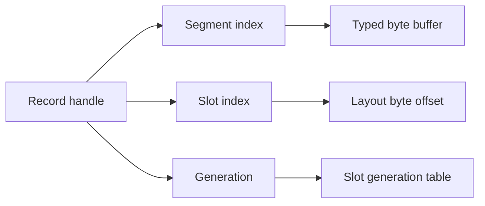

# Memory model

## Layouts and fields

A `RecordLayout` describes a fixed-size binary record. Typed field descriptors declare their name, scalar representation, byte width, alignment, and optional field-mask bit. The layout resolves offsets once at construction time, validates duplicate names and unsupported layouts, and exposes its final size and alignment.

The package supports signed and unsigned 8-, 16-, 32-, and 64-bit integers, 32- and 64-bit floating point values, boolean/bit-flag fields, and fixed-size byte fields. Numeric access uses `dart:typed_data` views and `ByteData` with an explicit endianness. Bulk numeric storage never relies on `List<int>` or `List<double>`.

`Uint64Field` preserves all 64 stored bits. Dart VM `int` values are signed at this width, so a read whose top bit is set is represented as a two's-complement negative value (for example, all-one bits read as `-1`). Treat that field as a raw 64-bit bit pattern, or use a fixed byte field when application code needs portable unsigned arithmetic beyond the signed range. Record versions intentionally stop at the signed 64-bit maximum rather than wrapping, preserving their monotonic ordering.

The dirty-mask representation supports at most 63 independently tracked fields because it uses a positive signed 64-bit Dart integer mask. A layout may still contain fields that do not participate in a selected subscription only if the implementation explicitly documents their mask behavior; the default is to reject layouts beyond that limit.

## Segments, slots, and handles

Records are allocated into fixed-capacity segments. A segment owns one byte buffer and metadata arrays for its slots. When capacity is exhausted, the store adds a new segment instead of relocating live records. This preserves handle stability for existing records.

A `RecordHandle` contains a segment index, slot index, and generation. Releasing a record invalidates its current generation and puts the slot on a reusable free list. Reallocation can reuse that slot with a newer generation. Any read, write, watch, or release through an old generation fails with a predictable stale-handle error rather than accidentally accessing a different record.

## Record lifetime

1. Allocate a record using its fixed layout.
2. Populate or update it through a controlled writer or transaction.
3. Read its latest committed values through a reader.
4. Dispose subscriptions associated with the record when no longer needed.
5. Release the handle when the record is permanently retired.

Releasing a record invalidates its subscriptions. A release is a lifecycle operation, not a state-change event that can safely be recovered by reading the old handle.

## Alignment and bounds

Each field begins at the next offset aligned for its declared scalar representation. The layout's record stride is rounded to its maximum field alignment. Offset, slot, and byte-range checks remain enabled in release builds; assertions supplement but do not replace validation.

## Zero-copy behavior and limits

The store exposes read-only, bounded byte views for fixed-size byte fields when the view can safely stay within the record's segment. Those views alias storage: they are snapshots of neither record lifetime nor future writes. Applications must not retain a view after releasing its record, and must copy it if a durable snapshot is required.

Scalar reads do not allocate record objects or copy an entire record. A record itself is not safely transferable between isolates. `TransferableTypedData` transfers byte ownership, not shared mutable access.
